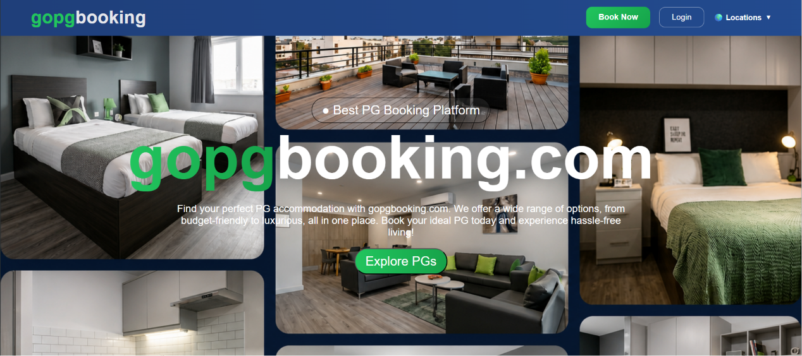
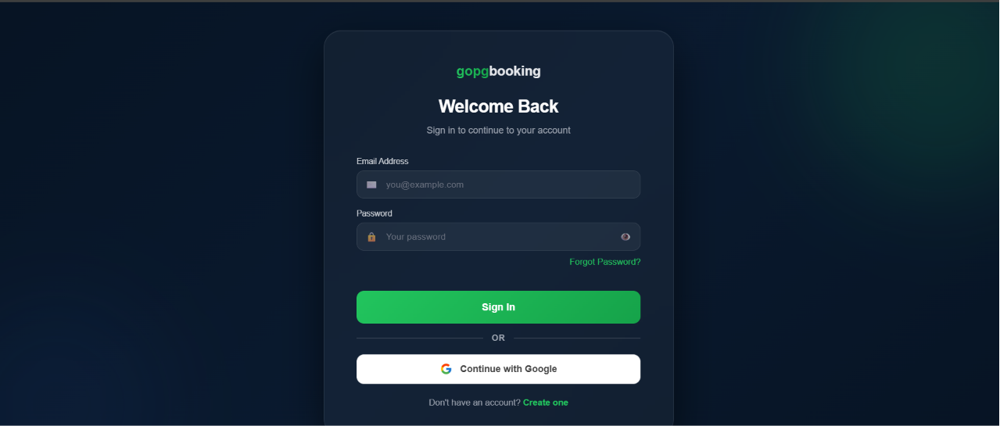
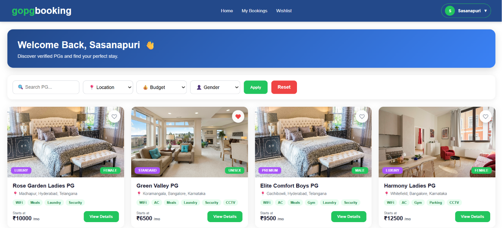
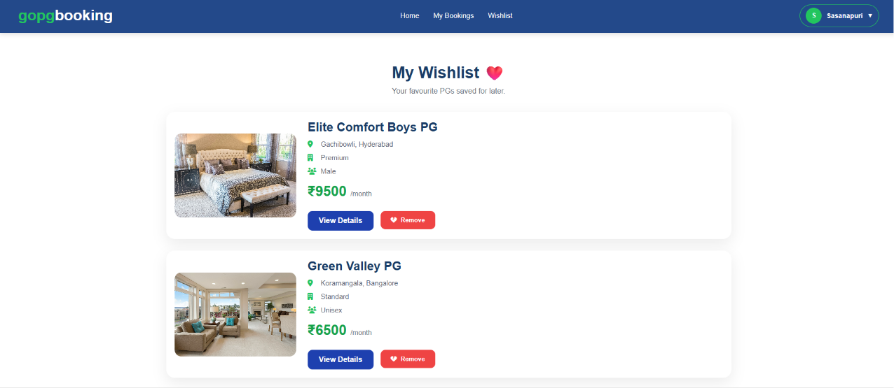
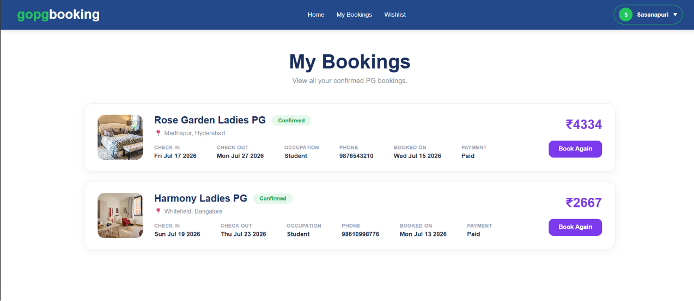
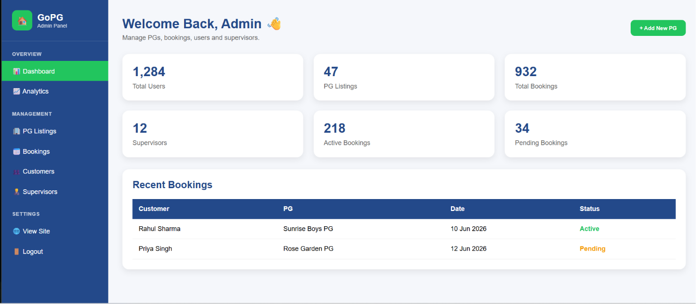

# 🏠 GoPGBooking

> > **GoPGBooking** is a full-stack web application built with **Node.js, Express.js, MongoDB, and EJS** that enables users to discover, compare, and book verified Paying Guest (PG) accommodations through a secure, user-friendly, and responsive platform.

---

## 🚀 Live Demo

🔗 **Website:** `https://gopgbooking.onrender.com`

---

## 💻 GitHub Repository

🔗 `https://github.com/jayanthsasanapuri/gopgbooking`

---
## Overview

**GoPGBooking** is a production-inspired **Paying Guest (PG) booking platform** that connects users directly with verified PG owners, eliminating the need for brokers and brokerage fees. The platform simplifies the process of finding suitable accommodation by allowing users to explore PGs across different locations, compare available options, and book rooms through a single platform.

Users can search PGs based on their preferred city, area, budget, gender, and accommodation type, view detailed property information, save their favorite PGs to a wishlist, and complete bookings online through a secure and user-friendly interface.

For PG owners and administrators, **GoPGBooking** provides a dedicated dashboard to manage PG listings, update property details, monitor bookings, and maintain accommodation information efficiently. By bringing users and PG owners together on one platform, **GoPGBooking** offers a transparent, convenient, and brokerage-free accommodation booking experience.
---

# ✨ Features

## 👤 User Features

- ✅ User Registration
- ✅ Secure Login
- ✅ Google OAuth Authentication
- ✅ Forgot Password via OTP
- ✅ Search PGs
- ✅ Filter by
  - Location
  - Budget
  - Gender
- ✅ View Detailed PG Information
- ✅ Wishlist Management
- ✅ Online Booking Flow
- ✅ Payment Summary
- ✅ Booking Confirmation
- ✅ My Bookings
- ✅ Logout
---
## 🛠️ Admin Features

- ✅ Secure Admin Login
- ✅ Admin Dashboard
- ✅ Add New PG
- ✅ Edit PG Details
- ✅ Delete PG
- ✅ View All PG Listings
- ✅ View User Bookings

---

# 🖼️ Screenshots

### 🏠 Home Page



---

### 🔑 Login Page



---

### 📋 PG Listings



---

### ❤️ Wishlist



---

### 📅 My Bookings



---

### 🛠️ Admin Dashboard



# 🛠️ Tech Stack

## Frontend

- HTML5
- CSS3
- JavaScript
- EJS

---

## Backend

- Node.js
- Express.js

---

## Database

- MongoDB Atlas
- Mongoose

---

## Authentication

- Express Session
- Passport.js
- Google OAuth 2.0

---

## Other Tools

- Git
- GitHub
- Render (Deployment)
- Nodemailer
- dotenv

---

# 📂 Project Structure

```text
GoPGBooking/
│
├── config/
├── controllers/
├── models/
├── routes/
├── public/
│   ├── css/
│   ├── images/
│   └── js/
│
├── views/
│   ├── admin/
│   ├── partials/
│   └── auth/
│
├── app.js
├── package.json
├── README.md
└── .env.example
```

---

# ⚙️ Installation & Setup

### 1. Clone the Repository

```bash
git clone https://github.com/jayanthsasanapuri/gopgbooking.git
```

### 2. Navigate to the Project Directory

```bash
cd gopgbooking
```

### 3. Install Dependencies

```bash
npm install
```

### 4. Configure Environment Variables

Create a `.env` file in the project root and add the following variables:

```env
MONGO_URI=your_mongodb_connection_string

SESSION_SECRET=your_session_secret

GOOGLE_CLIENT_ID=your_google_client_id

GOOGLE_CLIENT_SECRET=your_google_client_secret

GOOGLE_CALLBACK_URL=http://localhost:3000/auth/google/callback

EMAIL=your_email_address

EMAIL_PASSWORD=your_email_password

ADMIN_EMAIL=your_admin_email

ADMIN_PASSWORD=your_admin_password
```

### 5. Start the Application

For development:

```bash
npm run dev
```

For production:

```bash
npm start
```

### 6. Access the Application

Open your browser and visit:

```text
http://localhost:3000
```

# 🔐 Environment Variables

| Variable | Description |
|----------|-------------|
| MONGO_URI | MongoDB Atlas connection string used to connect the application to the database. |
| SESSION_SECRET | Secret key used to securely sign and manage Express session cookies. |
| GOOGLE_CLIENT_ID | Google OAuth Client ID for Google Sign-In authentication. |
| GOOGLE_CLIENT_SECRET | Google OAuth Client Secret for Google Sign-In authentication. |
| GOOGLE_CALLBACK_URL | Google OAuth callback URL used to handle authentication responses. |
| EMAIL | Email address used to send OTPs and application notifications. |
| EMAIL_PASSWORD | App password for the configured email account. |
| ADMIN_EMAIL | Email address used for administrator login. |
| ADMIN_PASSWORD | Password used for administrator authentication. |

---

# ⭐ Highlights

- Modern Responsive UI
- Google Authentication
- Secure Session Management
- MongoDB Atlas Integration
- Dynamic Search & Filters
- Wishlist Feature
- Booking Management
- Admin Dashboard
- MVC Architecture
- Clean Folder Structure

---

# 🚀 Future Enhancements

- ⭐ PG Ratings & Reviews
- 🗺️ Google Maps Integration
- 💳 Online Payment Gateway
- 📧 Email Booking Confirmation
- 📱 Progressive Web App (PWA)
- 🤖 AI-based PG Recommendation System
- 📊 Admin Analytics Dashboard

---

# 👨‍💻 Author

**Sasanapuri Jayanth**
LinkedIn: `https://www.linkedin.com/in/sasanapuri-jayanth/`
---
